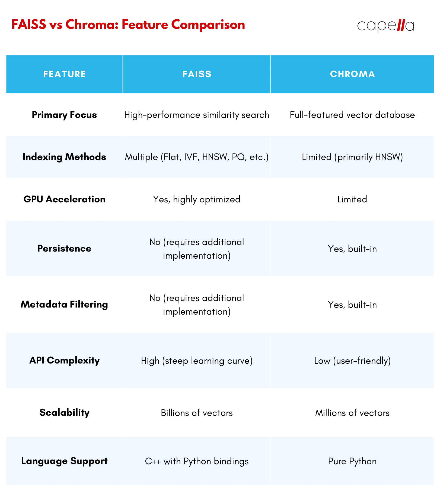

## Overview

Chroma is a relatively new player in the vector database world, but it has quickly gained momentum thanks to its user-friendly design and focus on providing a complete, end-to-end solution. Its intuitive interface makes it easy for developers at any level to get started, which sets it apart from other options on the market.

Unlike FAISS, which focuses primarily on indexing and search, Chroma is built as a fully featured database, offering crucial capabilities such as data persistence and metadata filtering. This means you don't have to piece together separate tools for these features, since Chroma has them all in one place.

Another standout feature is Chroma’s embeddability, which lets you seamlessly integrate it into Python applications. This makes it a natural choice for rapid prototyping and development, giving you the freedom to test ideas quickly without juggling multiple platforms.

Chroma also supports a variety of storage backends, including in-memory, SQLite, and cloud-based options. This flexibility means you can pick the storage solution that best suits your project. Whether you're building a small proof of concept or a large-scale application, Chroma adapts to your needs and lets you focus on building what matters.


## Code example

### **1. Initialize Chroma and Set Up a Collection**
Start by initializing the Chroma client, which acts as the interface to your database. Create or retrieve a collection to store embeddings, documents, and metadata.

```python
from chromadb import Client
client = Client()

collection_name = "cat_wiki"
collection = client.create_collection(name=collection_name) if collection_name not in client.list_collections() else client.get_collection(name=collection_name)
```

### **2. Prepare and Embed the Data**
Load your text data, clean it by splitting it into sentences and removing duplicates, then generate embeddings using a pre-trained model from `sentence-transformers`.

```python
from sentence_transformers import SentenceTransformer

with open('data/cat-wiki.txt', 'r', encoding='utf-8') as file:
    sentences = list(set([s.strip() for s in file.read().split('.') if s.strip()]))

model = SentenceTransformer('bert-base-nli-mean-tokens')
sentence_embeddings = model.encode(sentences)
```

### **3. Add Data to Chroma**
Store the sentences, embeddings, and metadata in the collection. Each item needs a unique identifier.

```python
collection.add(
    embeddings=sentence_embeddings.tolist(),
    documents=sentences,
    metadatas=[{"index": i} for i in range(len(sentences))],
    ids=[f"sentence_{i}" for i in range(len(sentences))]
)
```

### **4. Query and Retrieve Results**
Embed your search query, run a similarity search, and retrieve the most relevant results.

```python
query = "fur and teeth"
query_embedding = model.encode([query]).tolist()

results = collection.query(query_embeddings=query_embedding, n_results=4)

for idx, document in enumerate(results["documents"][0]):
    print(f"Result {idx + 1}: {document}")
```

### When not to use Chromas

1. **Scalability Concerns**: For extremely large datasets, Chroma might struggle with performance compared to other solutions designed specifically for high-throughput or distributed workloads. Its single-node architecture can be a limiting factor for enterprise-scale systems requiring horizontal scaling.

2. **Limited Ecosystem Integration**: Chroma is relatively newer and may lack the robust integrations and community support available in more mature tools like FAISS or Elasticsearch.

3. **Customization Constraints**: If your use case requires extensive customization of search algorithms or vector processing pipelines, Chroma's more streamlined interface may be less flexible than lower-level libraries.

4. **Maturity and Stability**: As a newer platform, Chroma might still have evolving features and less battle-tested reliability for mission-critical applications.

### Why FAISS Might Be Better

1. **High Performance**: FAISS is highly optimized for large-scale similarity search, providing blazing-fast query times, even on datasets with millions of vectors. It supports CPU and GPU acceleration, enabling efficient processing for intensive workloads.

2. **Customizability**: FAISS offers fine-grained control over indexing methods and distance metrics, allowing for advanced use cases requiring tailored algorithms or hybrid approaches.

3. **Proven Scalability**: FAISS is widely adopted in production systems for handling massive datasets, offering indexing techniques like IVF (Inverted File Index) and HNSW (Hierarchical Navigable Small World) for scalable search.

### Choosing Between Chroma and FAISS

The decision between Chroma and FAISS depends on your use case: 

- **Choose Chroma if** you need a quick, all-in-one solution for managing embeddings, metadata, and similarity searchs with minimal setup. It’s ideal for smaller-scale projects or when time-to-market is a priority.

- **Choose FAISS if** you require highly scalable, high-performance vector search capabilities, advanced customizability, or integration into a complex, large-scale system.

### Chroma vs FAISS

A straightforward and directs comparison of FAISS and Chroma

