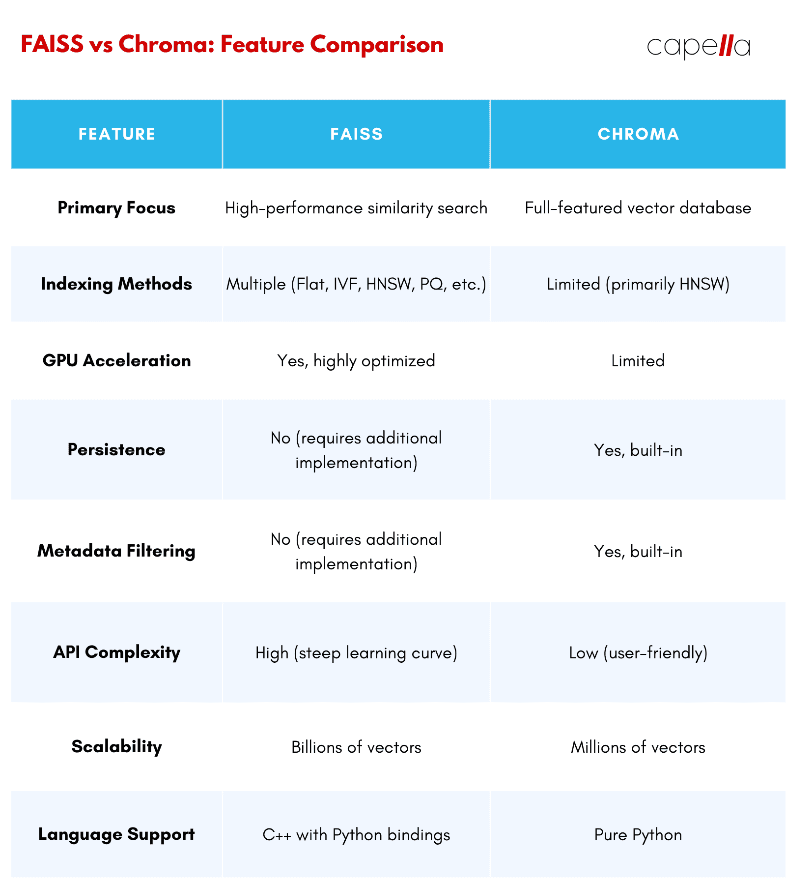

## Overview

Chroma is a relatively new player in the vector database world, but it has quickly gained momentum thanks to its user-friendly design and focus on providing a complete, end-to-end solution. Its intuitive interface makes it easy for developers at any level to get started, which sets it apart from other options on the market.

Unlike FAISS, which focuses primarily on indexing and search, Chroma is built as a fully featured database, offering crucial capabilities such as data persistence and metadata filtering. This means you don't have to piece together separate tools for these features, since Chroma has them all in one place.

Another standout feature is Chroma’s embeddability, which lets you seamlessly integrate it into Python applications. This makes it a natural choice for rapid prototyping and development, giving you the freedom to test ideas quickly without juggling multiple platforms.

Chroma also supports a variety of storage backends, including in-memory, SQLite, and cloud-based options. This flexibility means you can pick the storage solution that best suits your project. Whether you're building a small proof of concept or a large-scale application, Chroma adapts to your needs and lets you focus on building what matters.

## Chroma and FAISS

