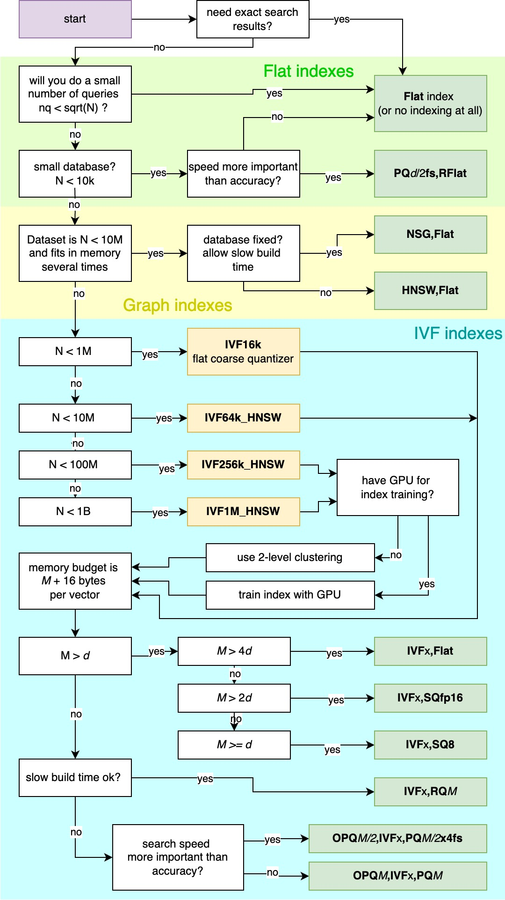
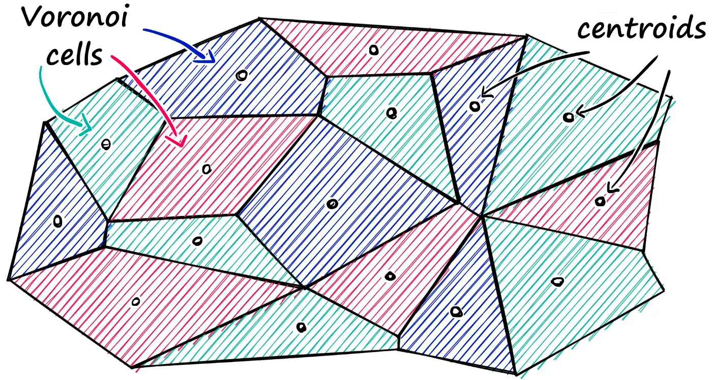
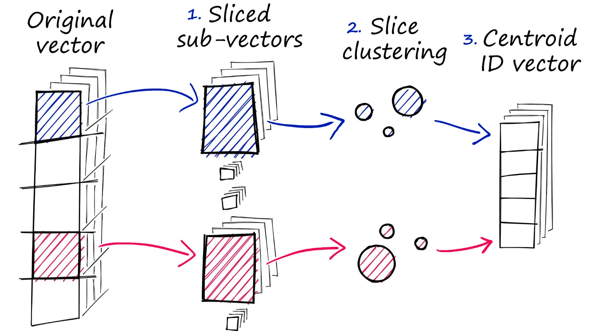

## Overview

In this section, we will explore RAG using the vector database FAISS.

We will walk through:
- Understanding how FAISS represents data in vectors.
- A simple code example that demonstrates how to index text data (from a Wikipedia article on cats) and query it using FAISS.
- Partitioning and quantizing vectors to speed up search (using indexes).

## What is FAISS?

FAISS, which stands for Facebook AI Similarity Search, is an open-source library developed by Facebook AI Research. It specializes in fast similarity search and clustering for dense vectors, making it particularly useful when working with large-scale datasets that demand efficient retrieval and analysis.

FAISS shines when you're dealing with huge piles of data, letting you quickly find what you need thanks to its smart indexing and retrieval features. It's been tested in the real world with massive databases, and it handles them like a champ without slowing down. By cutting through the complexity of data management, it becomes a go-to solution for projects that demand lightning-fast similarity searches and clustering of dense vectors.

## FAISS and data

1. **How the data is stored**  
   - The vectors are stored in a “row-major” matrix, meaning each row corresponds to one vector.
   - You have a bunch of vectors (points), of a specific dimension, e.g. the dimension is 64 meaning there are 64 points in a row.

2. **Two types of matrices**  
   - Database matrix: This holds all the vectors that you want to be able to search through. Its size is the number of database vectors multiplied by the dimension.

   - Query matrix: This holds the vectors for which you want to find the closest match(es) in the database. Its size is number of query vectors multiplied by the dimension.

In everyday terms:  
- **Think of the database matrix as your “phone book”** containing thousands or millions of entries (vectors).  
- **The query matrix is the “lookup card”** with the vectors you want to look up in the “phone book.”  
- Each row of these matrices is one complete “entry,” and since it’s row-major, you read across the row to get the vector’s full list of numbers.

## Installing FAISS

For this example, we will install the **CPU-only** version of FAISS, which avoids GPU compatibility issues (especially on macOS):

```bash
pip install -U faiss-cpu
```

### Vector Databases in FAISS

FAISS typically deals with two “vector databases”:
1. **The Vector Database**: This is the main database that contains all the vectors we want to search through.
2. **The Query Database**: This is where we store the vectors (often just a single query vector at a time) that we use to search the main database.

Both databases must have vectors of the same dimension. For instance, if your dataset vectors are 64-dimensional, then your query vector also needs to be 64-dimensional.

## Simple FAISS Example

In this example, we’ll load a Wikipedia article on cats, split it into individual sentences, clean them up, and use a `SentenceTransformer` model to convert each sentence into a numerical vector (embedding).

```python
import faiss
from sentence_transformers import SentenceTransformer

# Read the cats file
with open('cat-wiki.txt', 'r', encoding='utf-8') as file:
    text = file.read()

# Split the text by periods to get individual sentences
sentences = text.split('.')

# Clean up whitespace and remove any empty sentences
sentences = [s.strip() for s in sentences if s.strip()]

# Remove duplicates (using set) and ensure only strings remain
sentences = [word for word in list(set(sentences)) if type(word) is str]

# Initialize a SentenceTransformer model
model = SentenceTransformer('bert-base-nli-mean-tokens')

# Create embeddings for each sentence
sentence_embeddings = model.encode(sentences)
```

### 2. Create a FAISS Index

Next, we’ll check the dimension of our embeddings and create a simple `IndexFlatL2` index, which uses an L2-distance (Euclidean distance) to measure similarity.

```python
# Determine the dimensionality of the embeddings
d = sentence_embeddings.shape[1]

# Create an index of type IndexFlatL2
index = faiss.IndexFlatL2(d)

# Add the sentence embeddings to the index
index.add(sentence_embeddings)
```

- Dimension (𝑑): Each sentence embedding might be 768-dimensional, 415-dimensional, or some other dimension depending on your model.
- `IndexFlatL2`: A straightforward index that performs brute-force search using L2 distance.

**Why Use Indexes?**

When using FAISS, you must first create an **index** that tells FAISS how to store and organize your vectors for efficient search. There are many types of indexes in FAISS (e.g., `IndexFlatL2`, `IndexIVFFlat`, etc.). Each index type balances speed, memory usage, and accuracy differently, so choosing the right one depends on your data and use case.

The graph below nicely shows you which index to use for which situation.




### 3. Query the Index

To find which sentences in our dataset are most semantically similar to a given query, we embed our query with the same model, then search for the top 𝑘 k results:

```python
# Create an embedding for our query
k = 4
xq = model.encode(["fur and teeth"])

# Search the index
D, I = index.search(xq, k)
print(I)

# Retrieve the sentences corresponding to these indices
results = [f'{i}: {sentences[i]}' for i in I[0]]
print(results)
```

- Embed Query: Our query text (“fur and teeth”) is converted to a vector of the same dimension 𝑑.
- Search: We search for the top 4 most similar embeddings in the index.
  - `D` contains the distances of each matched vector to our query
  - `I` contains the indices of the matched vectors
- Retrieve Sentences: We use the indices in I to look up the original sentences in our `sentences` list.

## Optimization

### Partitioning (Voronoi Cells)

One common way to speed up FAISS searches is to partition your vectors into cells.

Imagine you’ve got a giant crowd of people, and you need to find the person who’s closest to you (say, in terms of height, weight, or any other characteristic). If you try to check every single person, it’ll take forever. 

So instead, you split the crowd into smaller groups—like “cells” or “neighborhoods.” Each group has a “leader” (a centroid). When you show up, you figure out which group’s leader you’re nearest to. Then you only search within that one group instead of the entire crowd. It’s an approximate method, because you skip all the other groups, but it’s way faster than looking at every single person in the room.



### Implementing Partitioning (IVF indexing)

**1. Decide How Many Cells (nlist)**

We first decide how many partitions, or “cells,” we want in our index. This number can significantly affect both the speed and accuracy of searches (more cells can offer faster but sometimes less accurate retrieval).

```python
nlist = 50  # How many cells
```

**2. Create a Quantizer**

A **quantizer** is needed to define the centroids (leaders) for each of our cells. Here, we use `IndexFlatL2`, which simply performs brute-force distance calculations to establish these centroids.

```python
quantizer = faiss.IndexFlatL2(d)
```

**3. Build the IVF Index**

Now we create an **IndexIVFFlat**. This index uses the quantizer to group vectors into `nlist` buckets (cells) for faster, approximate searches compared to brute-force.

```python
index_ivf = faiss.IndexIVFFlat(quantizer, d, nlist)
```

**4. Train the Index**

When we built the previous `IndexFlatL2`-only index, there was **no training** because no clustering or transformations were required.  
**However**, with `IndexIVFFlat`, we need to **train** the index on our embeddings so it can learn how to partition the space into cells.

```python
index_ivf.train(sentence_embeddings)
```

**5. Add Embeddings to the IVF Index**

After training, we add our vectors (in this case, the sentence embeddings) to the newly created IVF index.

```python
index_ivf.add(sentence_embeddings)
```

**6. Set the Number of Cells to Probe (nprobe)**

`nprobe` defines how many cells FAISS should search through when looking for approximate nearest neighbors. Searching more cells increases accuracy but can also slow down the search a bit.

```python
index_ivf.nprobe = 10
```

### Product Quantization (PQ)

When working with huge datasets, storing every vector in its full “Flat” form can quickly eat up a lot of space. Luckily, FAISS offers a feature called Product Quantization (PQ) to solve this problem.

But what does PQ do? You can think of it as an extra approximation step, somewhat like how IVF narrows down your search range. Instead of focusing on which vectors to compare (like IVF), PQ shrinks the vectors themselves, making the distance or similarity calculations more efficient. This compression happens in three main stages, helping strike a balance between speed and accuracy in massive vector databases.



**How the compression works:**
1. First, the full vector is cut into smaller “sub-vectors.”  
2. For each group of these sub-vectors, we use a clustering algorithm to generate several centroids.  
3. Finally, each sub-vector is replaced by the ID of the closest centroid within its group, effectively shrinking the original vector.

### Implementing Quantization

```python
m = 8  # number of centroid IDs in final compressed vectors
bits = 8 # Number of bits in each centroid

quantizer = faiss.IndexFlatL2(d)
index = faiss.IndexIVFPQ(quantizer, d, nlist, m, bits) 

index.train(sentence_embeddings)
index.add(sentence_embeddings)

D, I = index.search(xq, k)

print(I)
```

## FAISS With LangChain